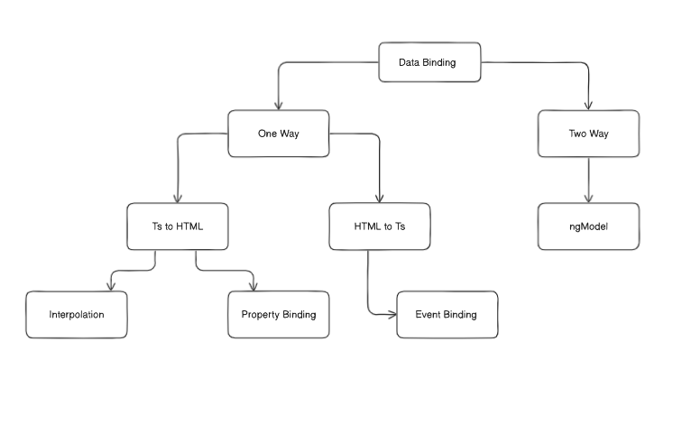

# Angular

Angular was developed by Google and is a Js framework used to create single page applications (SPAs). It uses typescript as a default language.

## Project Initalization

### Angular Cli

Install angular cli to create and manage angular projects

```
npm i -g @angluar/cli
```

Creating a Project

```
ng new <ProjectName>
```

### Files Details

1. #### Package.json

Creates entries of packages along with their version

2. #### Angular.json

Contains the configurations/settings of angular projects.

3. #### Main.ts

Starting Point of the application

4. #### app.config

Configuration file for the app component

## Core Concepts

Angular is a Single Page Appliation one page is present in Angular which is index.html
all the application is rendered in this page

By default app component is rendered as it has been used in the main.ts file

Actual code is present in the app component

## Components

### What is a Component

A component is a resulable block and serves as a building block in angular which contains HTML, CSS and TS

Component Includes:

1. Template (HTML)
2. Styles (CSS)
3. Class (Typescript)

### Creating Component

Command

```
ng generate component <componentName>
```

Or

```
ng g c <componentName>
```

E.g Component build : user

This creates a folder of the component which contains four files

1.  user.component.html (Template)
2.  user.component.css (Styles)
3.  user.component.ts (Class)
4.  user.component.spec.ts (Testing)

### 1. Template

Contains Structure of the component

### 2. Styles

Contains Styles of the component

### 3. Class ( Most Imp )

#### Structure

```
import { Component } from '@angular/core';

@Component({
  selector: 'app-user',                      // unique selector through which it can be rendered
  imports: [],                                // Contains imports
  templateUrl: './user.component.html',      // Template import
  styleUrl: './user.component.css'           // Styles import
})
export class AdminComponent {
  // Business Logic
}
```

### Rendering Component

To use Component in another component first import it in the component ts file.

Then write to component as an html tag to be rendered.

Code:

```
imports: [userComponent],
```

Then in Template file write the name that is provided in the module's named selector to render it

```
<app-user> </app-user>
```

Or

```
<app-user />
```

## Adding CSS library or Framework

First install it using npm

E.g

```
npm i bootstrap@latest
```

Add the npm folder path it in the options object present in the angular.json file

angular.json

```
....

 "styles": ["./node_modules/bootstrap/dist/css/bootstrap.min.css"],

....
```

## Routing

Routing is provided by default in angular

In the app folder the file app.routes.ts is given to create routes

Initially it looks like this

```
import { Routes } from '@angular/router';

export const routes: Routes = [];
```

To add routes create an object in the routes array with properties like path and component

Make sure to import components in the routes folder that will be used for routing.

```
export const routes: Routes = [
  {
    path : "user"           // add url on which component will be served
    component : userComponent     // add the name of the component
  },
];
```

Make sure to import routerOutlet in the app.component.ts

```
...

imports : [routerOutlet]

...

```

Add router outlet tag in the app template (app.component.html)

```
<router-outlet></router-outlet>
```

To create navigation link in template

use routerLink attribute

First import the compoent in the app.component.ts file in order to use it

E.g

```
<a routerLink = "/name-of-route">
```

## Data Binding

Most important and powerful thing of angular is data binding

How data is binded with the html

OR

Connecting the data present in the class (typescript) with the template (html)

Data Binding is mainly of two types
Here's an updated version of the nested markdown list with clearer explanations for each section:

- **One-way binding (Two Types)**

  1. **Class → Template (TS to HTML)**

     a. Interpolation  
     b. Property Binding

  2. **Template → Class (HTML to TS)**

     a. Event Binding

- **Two-way binding**

  1. Using `ngModel`

#### **See this Diagram for more understanding**



- Interpolation : Used for printing variables in html template {{ variableName }}
- Property Binding : Used for changing html properties values first enclose attribute in [] brackets and then add the value of variable

```
[placeholder] = namePlaceholder
```

- Event Binding : Used for performing tasks on dom events e.g click, mouseover enclose attr in () brackets and write the handler function name

**.html file**

```
<button (click)="showMsg()">  DOWNLOAD </button>
```

**.ts file**

Declare Function inside class component

```
export class DataBindingComponent {
  showMsg() {
    alert('Downloading started .......');
  }
}
```

## Signals

Introduced in Angular 18

Signals are used to handle reactive data in an angular application

Understanding Signals with an Example

Suppose you have a user name which is being displayed in mulitple components in your application like home, profile, friends, account etc now you want to make it sure that all the components have the same value so you wrap the name inside a signal

#### Creating Signal

```
userName =  signal('John Doe')    // without specifying data type

rollNo = signal<number>(23434)
```

Make sure to import the Signal component from angular/core in order to use it now

**Signals are Called as a Method**

_To singals value either in html or ts file it is always used as a method_

#### Updating Signal

To update signal use the .set() method
