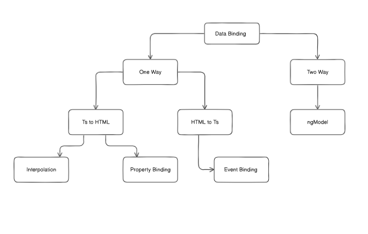

# Angular

Angular was developed by Google and is a Js framework used to create single page applications (SPAs). It uses typescript as a default language.

## Project Initalization

### Angular Cli

Angular cli is a command line tool which is used to create, develop, test, deploy and maintain Angular applications directly from command shell

Install angular cli to create and manage angular projects

```
npm i -g @angluar/cli
```

Creating a Project

```
ng new <ProjectName>
```

### Files Details

1. #### Package.json

Creates entries of packages along with their version

2. #### Angular.json

Contains the configurations/settings of angular projects.

3. #### Main.ts

Starting Point of the application

4. #### app.config

Configuration file for the app component

## Core Concepts

Angular is a Single Page Appliation one page is present in Angular which is index.html
all the application is rendered in this page

By default app component is rendered as it has been used in the main.ts file

Actual code is present in the app component

## Components

### What is a Component

A component is a resulable block and serves as a building block in angular which contains HTML, CSS and TS

Component Includes:

1. Template (HTML)
2. Styles (CSS)
3. Class (Typescript)

### Creating Component

Command

```
ng generate component <componentName>
```

Or

```
ng g c <componentName>
```

E.g Component build : user

This creates a folder of the component which contains four files

1.  user.component.html (Template)
2.  user.component.css (Styles)
3.  user.component.ts (Class)
4.  user.component.spec.ts (Testing)

### 1. Template

Contains Structure of the component

### 2. Styles

Contains Styles of the component

### 3. Class ( Most Imp )

#### Structure

```
import { Component } from '@angular/core';

@Component({
  selector: 'app-user',                      // unique selector through which it can be rendered
  imports: [],                                // Contains imports
  templateUrl: './user.component.html',      // Template import
  styleUrl: './user.component.css'           // Styles import
})
export class AdminComponent {
  // Business Logic
}
```

### Rendering Component

To use Component in another component first import it in the component ts file.

Then write to component as an html tag to be rendered.

Code:

```
imports: [userComponent],
```

Then in Template file write the name that is provided in the module's named selector to render it

```
<app-user> </app-user>
```

Or

```
<app-user />
```

## Adding CSS library or Framework

First install it using npm

E.g

```
npm i bootstrap@latest
```

Add the npm folder path it in the options object present in the angular.json file

angular.json

```
....

 "styles": ["./node_modules/bootstrap/dist/css/bootstrap.min.css"],

....
```

## Routing

Routing is provided by default in angular

In the app folder the file app.routes.ts is given to create routes

Initially it looks like this

```
import { Routes } from '@angular/router';

export const routes: Routes = [];
```

To add routes create an object in the routes array with properties like path and component

Make sure to import components in the routes folder that will be used for routing.

```
export const routes: Routes = [
  {
    path : "user"           // add url on which component will be served
    component : userComponent     // add the name of the component
  },
];
```

Make sure to import routerOutlet in the app.component.ts

```
...

imports : [routerOutlet]

...

```

Add router outlet tag in the app template (app.component.html)

```
<router-outlet></router-outlet>
```

router-outlet is a directive which is responsible to render activated component.

To create navigation link in template

use routerLink attribute

First import the compoent in the app.component.ts file in order to use it

E.g

```
<a routerLink = "/name-of-route">
```

### Navigating from .ts file

create an instance of router in the constructor (its is called injectables)

E.g:

```
constructor( private : router: Router){}

navigateToHome(){
  this.router.navigateByUrl('home')
}
```

## Data Binding

Most important and powerful thing of angular is data binding

How data is binded with the html

OR

Connecting the data present in the class (typescript) with the template (html)

Data Binding is mainly of two types
Here's an updated version of the nested markdown list with clearer explanations for each section:

- **One-way binding (Two Types)**

  1. **Class → Template (TS to HTML)**

     a. Interpolation  
     b. Property Binding

  2. **Template → Class (HTML to TS)**

     a. Event Binding

- **Two-way binding**

  1. Using `ngModel`

#### **See this Diagram for more understanding**



- Interpolation : Used for printing variables in html template {{ variableName }}
- Property Binding : Used for changing html properties values first enclose attribute in [] brackets and then add the value of variable

```
[placeholder] = namePlaceholder
```

- Event Binding : Used for performing tasks on dom events e.g click, mouseover enclose attr in () brackets and write the handler function name

**.html file**

```
<button (click)="showMsg()">  DOWNLOAD </button>
```

**.ts file**

Declare Function inside class component

```
export class DataBindingComponent {
  showMsg() {
    alert('Downloading started .......');
  }
}
```

## Directives

- Strutural Direactives
  Responsible for the change in structure of the DOM Element (DOM Manipulation)

To use directives in your components first must import **CommonModule** from angular/common

Commonly Used Directives

- \*ngIf
- \*ngFor ( Requires Array )

- Attribute Directives

  Can only change the property cannot add or remove element

  - \*ngStyles
  - \*ngClass

## Control Flow

Angular templates support control flow blocks that let you conditionally show, hide, and repeat elements.
This was previously accomplished with the structural Directives

E.g @if, @else if , @else , @switch

_**Does not needs any kinds of module imports for working as directives require commonModule to work properly**_

## Pipes

Pipe is basically used to format the data in the HTML Template

First import the required pipe from angular/common in order to use it in your code

#### Text Pipes

- uppercase
- lowercase
- titlecase (First Letter Capital)

#### Date Pipes

Example

```
{{ variableName | date : 'format'}}

{{ date | date : 'fullDate' }}

{{ date | date : 'dd-MMM-yyyy' }}

// Three M's shows the month name instead of number
```

#### JSON Pipes

Used by Developer to print an object to the DOM

```
{{ currentTime | async | date : "hh:mm:ss" }}
```

#### Custom Pipe

use the command to generate a new Pipe

```
ng g p <pipeName>
```

It will create tow files .ts and .spec.ts (for testing)

1. .Ts File

```
import { Pipe, PipeTransform } from '@angular/core';

@Pipe({
  name: 'firstPipe'
})
export class FirstPipePipe implements PipeTransform {

  transform(value: unknown, ...args: unknown[]): unknown {
    return null;
  }

}
```

A Pipe always contains a transform functions which have two parms value and extra prams

Sample Pipe to print 'No Value Present' if data is null, undefined or empty string

```
import { Pipe, PipeTransform } from '@angular/core';

@Pipe({
  name: 'na',
})
export class NaPipe implements PipeTransform {
  transform(value: unknown, ...args: unknown[]): unknown {
    if (value !== undefined && value !== null && value !== '') {
      return value;
    } else return 'No Value Present';
  }
}
```

Usage in HTML File

```
<div class="col-3">{{ city | na }}</div>
```

## Forms

Two main types of forms in Angular

### 1. Template forms

- More code in .html
- Easy Validation
- Less Code in .Ts
- uses ngModel
- Suitable for Simple Forms

#### Steps

1. Create object where all the fields are presend and then bind it to the input elements by ngModel

2. On click of submit or click we will get the form Object

3. Using the data and like sending to Api

_**Template forms use ngModel so when using ngModel inside a form tag it is necessary to add a name attribute in the input tag**_

In order to give error on a specific field absence first give the input #value = "ngModel"

then use the #value to target the input and perform validation

**Sample Code**

Input

```
<input
  type="text"
  class="form-control"
  id="validationCustom01"
  placeholder="E.g: John"
  [(ngModel)]="userData.firstName"
  name="firstName"
  required
  minlength="3"
  #fName="ngModel"
/>
```

Error Div

```
<div class="text-danger">
  @if(fName.touched && fName.errors?.['required']) {
  <span> Field Required </span>
  } @else if(fName.touched && fName.errors?.['minlength']){
  <span>Min 3 Chars Required</span>
  }
</div>
```

#### Validation

Make a property with hash and store the ngModel in it and then perform the validation functions on the hash property

### 2. Reactive forms

Reactive form are complex

- Create Form in the Class Component

First import the necessary modules for creating reactive forms

```
import { FormControl, FormGroup, ReactiveFormsModule } from '@angular/forms';
```

1. Create a Form Group which includes all the fields that you are taking input from the user

```
userData : FormGroup = new FormGroup({
  firstname : new FormControl()
  ....
  ....
})
```

2. Bind the form with html

In the form tag or any other tag in which the from is enclosed bind the name of the form to the property formGroup

```
<form [formGroup] = 'userData'>
```

3. Now the form has been binded with the Template next step is to bind every property with the property present in the formGroup give the name of the property to the attribute formControlName

```
<input type='text' formControlName = 'firstName'>
....
....
```

4. Receiving data from reactive form

the forms value is present inside the forms object.value

```
formValues: any

onSubmit(){
  this.formValues = this.userData.value
}
```

#### Validation

To give validation constraints import validators and use them when initializing the formGroup

```
firstName: new FormControl('Mark', [
  Validators.required,
  Validators.minLength(3),
]),
```

## HTTP Client

**It is a library provided in angular by default to make Api Calls**

_**IF the data has an unknown shape, then a safer alternative to any is to use the unknown type as the response type.**_

First import and add the provideHTTPClient function in the provide array in app.conifg.ts

By default angular uses the XMLHTTP method to change this import withFetch() and pass a parameter to the provideHttpClient() function

app.config.ts

```
providers: [
  ....
  provideHttpClient(),
  ....
],
```

Adding the HTTPClient in the component

1. Adding by Constructor

```
constructor(private http: HTTPClient){
  code
}
```

2. Injecting in the component

```
http = inject(HTTPClient)
```

### Get Request

Create the fucntion that whill get the data

```
getUsers(){
  this.http.get('url').suscrible((res:any) =>{
    console.log(res)
  } )
}
```

To get data on component load put the funtion inside the class constructor

```
constructor(private http: HttpClient) {
  this.getUser();
}
```

By default HTTPClient assumes that the server will send json data however to change this behaviour you can mention datatype while making the request

```
this.http.get('url',{responseType: text | buffer | blob | arraybuffer })
```

### Post Request

First check which object is requried to send in the api

then create that object and bind the form with that object

On Submit Call the post method and handle the response accordingly

```
onSubmit() {
this.http
  .post('https://projectapi.gerasim.in/api/Complaint/AddNewDepartment', {
    departmentId: 0,
    ...this.deptForm.value,
  })
  .subscribe((res: any) => {
    if (res.result) {
      alert('Success');
      this.getDepartments();
    } else {
      alert(res.message);
    }
  });
}
```

### Put Request

Used to update value in the server

## Services

The Component should be a lightweight and the api calls should not be included in it

**_Service_** : A Service is a file where the resulabe code is present

Mostly service is used for api calls

### Creating a Service

Use command to create service

```
ng g s <serviceName>
```

Two files will be initilized

```
<serviceName>.service.ts
<serviceName>.service.spec.ts
```

Inside the <serviceName>.service.ts file in the constructor initialize an HTTPClient

```
constructor(private http: HTTPClient){}
```

Make Sure to import the HTTPClient Module first then use it

Create functiosn and return the api result to the function

#### Get Request

```
getDepartments() {
  return this.http.get(
    'https://projectapi.gerasim.in/api/Complaint/GetParentDepartment'
  );
}
```

#### Post Request

```
saveNewDept(department: any) {
  return this.http.post(
    'https://projectapi.gerasim.in/api/Complaint/AddNewDepartment',
    department
  );
}
```

### Using the service in another module

Now in the module you want to use initialize the serve in the constructor of that module

```
constructor(private deptServ: ServiceClassName){}
```

Make sure to import hte ServiceClassName Compoenet in order to use the service

#### Using Service

It is similar just in the place of the api the name of the handler function in the service is written

**Get Request**

```
getDepartments() {
  this.deptSer.getDepartments().subscribe(
    (res: any) => (this.departmentList = res.data),
    (error) => {
      console.log(error);
    }
  );
}
```

**Post Request**

```
saveNewDept(department: any) {
  return this.http.post(
    'https://projectapi.gerasim.in/api/Complaint/AddNewDepartment',
    department
  );
}
```

Servies can also be used to write business logic

## @Input @Output

Primarily used for transfer of data between parent and child component

@Input : Parent to child
@Output : Child to parent

They are also used to make Resuable Components

1. @Input

First creates the variables that are will be used in the child component
with @Input adding before the variable

alert.component.ts

```
@Input() message: string = '';
```

Bind the variable in the Template file

```
<p> {{message}} </p>
```

Using in Parent Component

Add the selector of the component as a html tag and provide the variable as a prop to it

```
<app-alert message="'Hello There'"> </app-alert>
```

Or

```
<app-alert message="'Hello There'" />
```

2. @Output

Used to send data to the parent component

Create an output and event emitter

```
@Output() onBtnClick = new EventEmitter<any>()
```

Emit(send) specific value on specific event let's say we want to send data on button click

Create button

```
<button (click)="onClick()"> {{btnText}} </button>
```

Now emit the value when the button is clicked

```
onClick(){
  this.onBtnClick.emit('Value passed to parent from child')
}
```

In Parent Component

```
<app-custom-btn (onBtnClick)="getData($event)" />
```

Always use $event to get value from the child in parent component

```
getData(data: any) {
  console.log(data)
}
```

## Component LifeCycle

A sequence of steps that happen in component between its creation and destruction

**Constructor is not a lifecycle Event**

1. Constructor

A js funtion which is executed when the page loads

Used to call the funtion and initilize variables

2. ngOnInit

It is executed when the component has loaded.
Api's calls are usually made in this hook

3. ngDoCheck

Any change happens in the content

4. ngAfterViewInit, ngAfterContentInit

If any external view, content or image is imported than after its intilization these fuctions are triggered.

5. ViewInit , ViewCheck

Executes after the HTML of the component and if any other is used then its html intilization

After Complete view is intilized

6. onDestroy

When the component is destroyed
Normally used to unsuscribe the api call

7. ngOnChange

Used in reuseable components
When a value that is being passed to a resulabe component is changed then this is triggered

### Mostly Used

- onInit
- afterViewInit
- onDestroy
- onChange

## ng-template directive

It is a directive like ngIf, ngFor etc.

It is a hidden/imaginory div that has to be initialzed in order to make it visilbe

First create the section which you want ot display conditionlay

**Note: @if @else can also be used but if the block has to be displayed in multiple places then it is best**

```
<ng-template #notLoggedIn>
  <div class="bg-danger rounded col-3 p-3 m-2">
    <span>Please Log in to continue</span>
  </div>
</ng-template
```

Then wirte it in the else condition in ngIf directive

```
<div
  class="col-3 p-3 m-2 bg-info rounded"
  *ngIf="isLoggedIn; else notLoggedIn"
>
  Welcome {{ userName }}
</div>
```

Wrap ui in template which won't render unless you don't

### Dynamically Loading Template

create the ViewChild of both element the parent and the ng template which is to be displayed

```
@ViewChild('origninalHashName') customName : TemplateRef <any> | undefined
@ViewChild('origninalHashName', {read : ViewContainerRef}) customName : ViewContainerRef <any> | undefined   // in which ng-template is to be rendered
```

Display on click event

```
onClick(){
  if(this.container){
    this.container?.createEmbededView('templateCustomName')
  }
}
```

**@ViewChild() is similar to document.getElementById()**

## ng-container

ng-container is also a directive
It is also an imaginory div or html element

**_See ng-container component for detailed information_**
